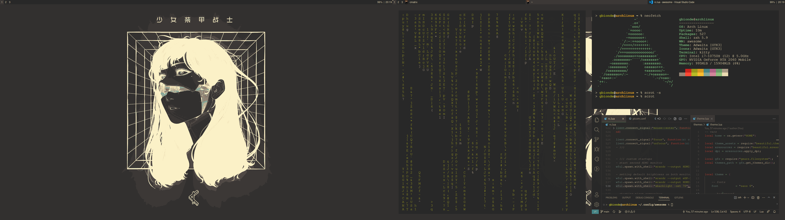
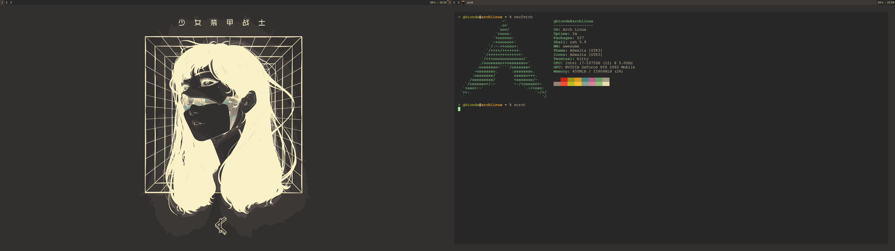

# Dotfiles
My arch linux awesome window manager dotfiles (nvidia drivers).

- [Wallpaper](https://gruvbox-wallpapers.onrender.com/)
- [Color Scheme](https://github.com/morhetz/gruvbox) (gruvbox)

# Packages
- [Feh](https://wiki.archlinux.org/title/feh): image viewer aimed mainly at users of command line interfaces. 
- [Thunar](https://wiki.archlinux.org/title/thunar): file explorer, default for XFCE desk env.
- [Kitty](https://wiki.archlinux.org/title/kitty): terminal emulator.
- [Picom](https://github.com/yshui/picom): X11 compositor.
- [Zsh](https://www.zsh.org/): zsh terminal shell.  
- [Scrot](https://github.com/resurrecting-open-source-projects/scrot): command line screen capture utility

# About awesome

Awesome is a highly configurable, next generation framework window manager for X. It is very fast, extensible and licensed under the GNU GPLv2 license. It is primarily targeted at power users, developers and any people dealing with every day computing tasks and who want to have fine-grained control on their graphical environment.

It is fully configurated and customized with .lua, but you can extend it to .py if you wish. 

[Start learning about awesome here](https://awesomewm.org/)
